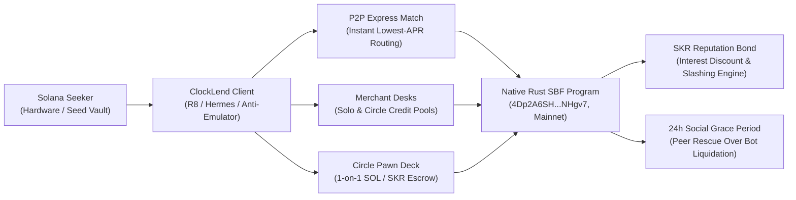
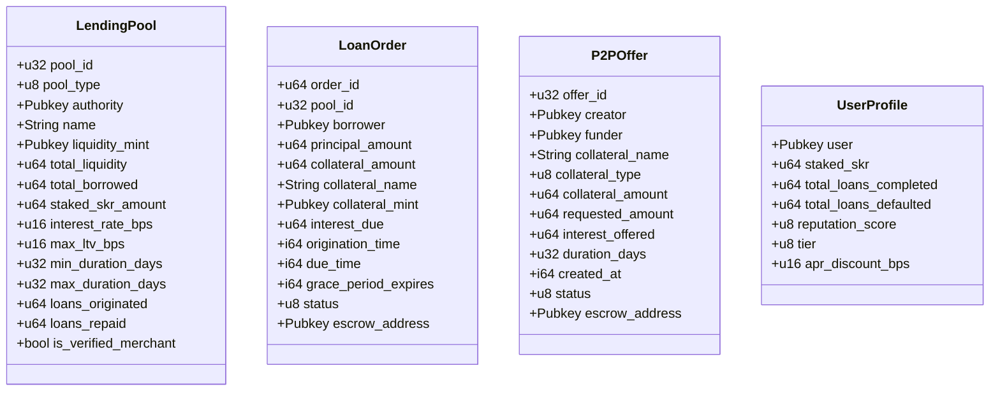
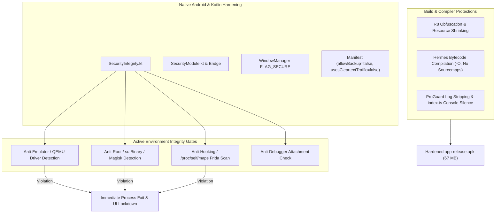

# 📱 ClockLend
### *Next-Gen P2P Micro-Lending & Social Pawns on Solana Seeker*
> **Built for the Solana Mobile CLOCK IN Hackathon (RadiantsDAO & Solana Mobile)**  
> **Mainnet Program ID:** [`4Dp2A6SHQHEpuoMT4GuzZnnpLcDYrJnpELm1UjuNHgv7`](https://solscan.io/account/4Dp2A6SHQHEpuoMT4GuzZnnpLcDYrJnpELm1UjuNHgv7) — deployed and bytecode-hash-verified  
> **Devnet Program ID:** [`HAjGxuih14imCMaWvCnJQ3nSdWmS8PQKzp74gyAgjsH3`](https://explorer.solana.com/address/HAjGxuih14imCMaWvCnJQ3nSdWmS8PQKzp74gyAgjsH3?cluster=devnet) (exists on devnet only)  
> **Physical Target Hardware:** Solana Seeker (Android 14+ / Seed Vault / MWA 2.0)  
> **Security Audit Status:** 14 internal AI-assisted rounds • 103 on-chain test functions • **no third-party audit** • round-14 fixes are deployed (verified 2026-09-29)

---

## 🏭 Production Status (verified 2026-09-29)

The app is **mainnet-only**: every money flow executes on mainnet-beta, all devnet
faucet/switch UI has been removed, and the data layer is fully network-aware.

**Program** — **deployed on Solana Mainnet-beta**, bytecode-verified against this repo:
- Program `4Dp2A6SHQHEpuoMT4GuzZnnpLcDYrJnpELm1UjuNHgv7`, ProgramData
  `9ikmDTbbRhtgYKjRhcnzCK9RpPWQ8uTYUeNJ16kWMLSG` (367,757 B allocated / 364,536 B ELF;
  the remainder is retained zero padding), deploy slot `451698349`,
  upgrade authority `8YvdDpWVAxpuyDHw3tpUheq99vgtakFELdqezykYosds`
- **Last verified deploy: 2026-09-29.** At that moment the deployed bytecode matched a local
  `cargo-build-sbf` build of this repository byte-for-byte over all 364,521 non-padding bytes
  (artifact sha256 `6d1c3ec2443f713e2cefd29fcd45a0d26c54b63454d0a4d6323f5d7878b7249b`, which is
  what `deploy-mainnet.mjs` compares against the on-chain slice
  `ProgramData.data[45 : 45 + localSize]`). Recipe and re-verification procedure:
  [`docs/MAINNET_RUNBOOK.md`](docs/MAINNET_RUNBOOK.md) §1.1
- ⚠️ **The source has since moved ahead of the deployment.** The round-15 hardening below is
  committed but **not yet on chain**, so a rebuild today will NOT reproduce the hash above and
  the deployed program is no longer provably this repository. Re-verify (and re-record the
  hash) after the next upgrade. Until then, treat the deployed program as round-14-state.
- 103 on-chain test functions across six suites (`grep -c '#\[test\]\|#\[tokio::test\]' program/tests/*.rs`)
- 8-byte account discriminators with fail-closed dispatch, ProgramData-derived admin root,
  PDA-verified escrows with front-run authority defense
- **Upgradeable**, not immutable: the deployer key can replace the program

**Deployed but not yet used.** The only program-owned accounts on mainnet are the two price
feeds, the AdminConfig PDA, one lending pool and the SKR yield vault. The pool holds $50.00
USDC of the team's own liquidity and has originated **zero loans**; there are no P2P offers
and no user profiles. The treasury PDA has never been initialized, so no fee has ever been
collected.

**Open items — see [`docs/MAINNET_RUNBOOK.md`](docs/MAINNET_RUNBOOK.md) §5:**
1. The keeper is not running reliably; as of 2026-09-29 both mainnet feeds were ~81 minutes
   stale against the program's 600-second bound, so borrows that read them revert. Only four
   successful feed writes exist on mainnet, hours apart — the `*/6` cron is not firing.
2. The live pool was created before the round-14 LTV cap with `max_ltv_bps = 9000`, and the
   program has no instruction to update pool parameters. New pools are capped at 7000 bps;
   this one is not, and cannot be retrofitted.
3. No third-party audit has been performed
4. A Helius RPC API key is committed in `serverless/wrangler.toml` (now a comment) and is
   still live — **it must be rotated with the provider**, not merely deleted from the repo
5. ~~The AWS Lambda keeper has two auth bypasses~~ **resolved** — the Lambda has been removed
   entirely rather than maintained. It was a third deployment of the same `crankOracles` code
   with no unique logic, and it held a third copy of the oracle signing key. Cloudflare is now
   the only scheduled runner; see `serverless/README.md` for the failover trade-off and
   `docs/KEEPER_LIVENESS.md` for what actually makes a single runner safe
6. `/health` on the Cloudflare worker returns `rpcUrl` unredacted, exposing the API key to
   anonymous callers
7. **Round-15 hardening is committed but not deployed.** Source-side fixes for four issues
   found in the 2026-09-29 audit — the P2P LTV cap was 9000 while the pool cap was 7000;
   `BorrowFromPool` was the only money handler missing a pool-PDA re-derivation; the
   permissionless borrow path could fold the SKR yield backlog into share value (letting a
   just-in-time staker drain it with ~20 dust borrows); and `AccountKind` classified any
   182-byte first-byte-1 slice as a `LendingPool`. Five regression tests pin the new
   behaviour. **None of it is on chain** — the deployed program still has all four.

**Infrastructure**
- RPC: Helius gatekeeper → configured RPC → PublicNode → official fallback (env-driven,
  `mobile/.env` `EXPO_PUBLIC_*` vars, gitignored)
- Pricing: Jupiter Price API v3 for SOL **and SKR** with CoinGecko fallback; the keeper
  refreshes both on-chain feeds from the same source
- Keeper: **one implementation** — the Cloudflare Worker in `serverless/` (`crankOracles`, run on a
  `*/3` cron and now verifying both feeds after each crank). The same code backs the manual CLI
  (`serverless/src/cli.mjs`) and the `.github/workflows/keeper.yml` failover; the standalone
  `mobile/scripts/keeper.mjs` duplicate was removed so the two cannot drift apart again
- Deploy: `mobile/scripts/deploy-mainnet.mjs` — program (with `--upgrade` for real upgrades),
  admin init (ProgramData proof), treasury ATA, SOL/SKR feeds, first desk

---

## 📑 Table of Contents
1. [Executive Summary & Hackathon Pitch](#-executive-summary--hackathon-pitch)
2. [Project Whitepaper](#-project-whitepaper)
   - [The Problem: The Failure of DeFi Lending for Everyday Mobile Users](#1-the-problem-the-failure-of-defi-lending-for-everyday-mobile-users)
   - [The Solution: ClockLend Architecture](#2-the-solution-clocklend-architecture)
   - [Cryptographic Invariants & Program Derived Addresses (PDAs)](#3-cryptographic-invariants--pdas)
   - [Economic Engine: SKR Reputation Bond & Protocol Monetization](#4-economic-engine-skr-reputation-bond--protocol-monetization)
3. [Core Product Modules](#-core-product-modules)
   - [1. P2P Express Desk (1-Tap Algorithmic Match)](#1-p2p-express-desk-1-tap-algorithmic-match)
   - [2. Merchant Desks & Circle Pools](#2-merchant-desks--circle-pools)
   - [3. Circle Pawn Deck (1-on-1 Social Pawns)](#3-circle-pawn-deck-1-on-1-social-pawns)
   - [4. The Ticking Clock & 24h Social Grace Period](#4-the-ticking-clock--24h-social-grace-period)
4. [Hardware & Application Security Hardening](#-hardware--application-security-hardening)
   - [Anti-Decompilation & Hermes Bytecode](#anti-decompilation--hermes-bytecode)
   - [R8 / ProGuard Code Minification & Log Stripping](#r8--proguard-code-minification--log-stripping)
   - [Anti-Simulator / Anti-Emulator Guard](#anti-simulator--anti-emulator-guard)
   - [Anti-Root, Anti-Frida & Anti-Debugging](#anti-root-anti-frida--anti-debugging)
   - [Data Leakage Prevention (FLAG_SECURE & Manifest Hardening)](#data-leakage-prevention-flag_secure--manifest-hardening)
5. [User Documentation & Walkthroughs](#-user-documentation--walkthroughs)
   - [Borrower Walkthrough (Instant Micro-Loan)](#borrower-walkthrough-instant-micro-loan)
   - [Lender / Merchant Walkthrough (Deploying a Desk)](#lender--merchant-walkthrough-deploying-a-desk)
   - [P2P Pawn Walkthrough (Listing & Funding)](#p2p-pawn-walkthrough-listing--funding)
   - [SKR Staking Walkthrough (Interest Discounts & Bonds)](#skr-staking-walkthrough-interest-discounts--bonds)
6. [Real-World Use Cases & Scenarios](#-real-world-use-cases--scenarios)
7. [Smart Contract Verification & Test Suite](#-smart-contract-verification--test-suite)
8. [TARDIS & Solana Ecosystem Synergy](#-tardis--solana-ecosystem-synergy)
9. [Local Build, Compilation & Deployment Guide](#-local-build-compilation--deployment-guide)
10. [Hackathon Evaluation Matrix Alignment](#-hackathon-evaluation-matrix-alignment)

---

## 🏆 Executive Summary & Hackathon Pitch

**ClockLend** reinvents peer-to-peer credit for the mobile era. By combining frictionless, instant peer-to-peer trading mechanics with the native hardware superpowers of the **Solana Seeker** (Seed Vault, Mobile Wallet Adapter, and Secure Enclave), ClockLend introduces an intuitive, human-centered micro-lending platform.



### Why ClockLend Wins the CLOCK IN Hackathon:
1. **Engineered Exclusively for Solana Seeker Hardware**:
   - Native Mobile Wallet Adapter (MWA 2.0) with zero web-view dependencies.
   - Screen recording and screenshot shielding via Android `FLAG_SECURE`.
   - Native biometrics and Seed Vault hardware signing integration.
   - 0ms local hybrid state hydration ensuring instantaneous launch and offline resilience.
2. **Deep Economic Alignment with the $10,000 SKR Track**:
   - SKR is not a speculative add-on; it is the **fundamental reputation currency** of ClockLend.
   - Staking SKR unlocks up to a **25% interest-rate discount**, sliding continuously from 1% at 100 SKR to 25% at 10,000 SKR, with a flat SKR bond per discount band (100 / 250 / 500 / 1,000 SKR) that is locked while a loan is live and released — never slashed — on default, plus a merchant credit verification badge. It does **not** change LTV.
   - SKR serves as the **default collateral asset** for instant micro-loans across the protocol.
3. **Institutional-Grade Defense-in-Depth**:
   - Macro-free, native `solana-program` Rust smart contract with pure integer math (100% SBF floating-point immunity).
   - Strict SPL Token Program ID validation, front-running lamport injection DoS immunity, and funder repayment destination verification.
   - Built-in Android hardware integrity detector (`SecurityIntegrity.kt`) that prevents execution on simulators, rooted devices, or Frida/Xposed dynamic instrumentation hooks.
   - Production R8 bytecode minification and Hermes bytecode compilation without sourcemap leakage.

---

## 📄 Project Whitepaper

### 1. The Problem: The Failure of DeFi Lending for Everyday Mobile Users
Traditional DeFi lending markets (Aave, Solend, Kamino) were designed for desktop whale capital and high-frequency liquidation arbitrageurs:
- **Excessive Overcollateralization (150% - 200%)**: Borrowing $100 requires locking $150 to $200 in volatile assets, rendering micro-loans useless for real-world cashflow needs.
- **Merciless MEV Liquidation Bots**: A momentary price wick immediately triggers bot liquidations with punitive 5% to 15% liquidation penalties, vaporizing borrower collateral without warning.
- **Total Lack of Social / Bilateral Context**: Lenders cannot extend favorable credit terms to friends, colleagues, hacker house cohorts, or DAO members based on social reputation.
- **Illiquidity of Non-Standard Assets**: NFTs, compressed NFTs (cNFTs), pre-order tokens, and ecosystem tokens (like SKR) are completely ignored by pooled algorithmic money markets.

### 2. The Solution: ClockLend Architecture
ClockLend introduces a hybrid credit paradigm combining **algorithmic micro-pools**, **bilateral P2P pawn agreements**, and **social reputation mechanics**:
1. **P2P Express Desk Paradigm**: Borrowers select their preferred collateral and desired loan term; the protocol's routing algorithm scans live Merchant Desks and fills the loan at the lowest available APR within milliseconds.
2. **The Ticking Clock Mechanic**: Borrowers are greeted by a prominent countdown clock for each active debt obligation. Time-to-maturity is gamified, establishing clear repayment deadlines.
3. **The Social Safety Net (24h Grace Period)**: When a loan passes its due date without repayment, ClockLend does **not** instantly trigger an auction bot. Instead, an on-chain **24-Hour Social Grace Period** is initiated. Circle peers and friends receive high-priority alerts allowing them to fund a buyout, salvaging the borrower's credit score and acquiring the underlying asset at a discounted rate within the community.
4. **Treasury Monetization & Sustainable Economics**:
   - **Origination Fee — 0.25% (native-SOL collateral) / 0.50% (SKR collateral)**: Withheld
     from the borrowed principal at disbursement. Split 50% to the Treasury PDA and 50% to
     the SKR Yield Vault when the yield-vault accounts are supplied; otherwise 100% to the
     Treasury PDA.
   - **15% Interest Take-Rate**: Deducted from earned interest upon successful repayment.
   - **50% Surplus Split**: On a priced default, half of any collateral value above the
     outstanding principal + interest goes to the treasury. With no usable price feed the
     fallback is a flat 5% of the collateral instead.
   - There is **no insurance reserve**: no such mechanism exists in the program.

---

### 3. Cryptographic Invariants & PDAs

The ClockLend protocol operates on **Solana Mainnet-beta** via Native Rust (`solana-program` 2.2.1). Every transaction is atomically guarded by deterministic Program Derived Addresses (PDAs):



#### PDA Seed Formats:
| PDA Type | Derivation Seeds | Purpose |
| :--- | :--- | :--- |
| **Lending Pool** | `[b"pool", authority, pool_id.to_le_bytes()]` | Holds pool parameters and accounting. Authoritative seeds, per `process_initialize_pool` |
| **Pool Vault** | `[b"vault", pool_pda]` | The pool's liquidity SPL token account, owned by the vault PDA |
| **Loan Order** | `[b"loan", pool_pda, borrower, loan_id.to_le_bytes()]` | Per-loan record |
| **Loan Escrow** | `[b"escrow", loan_pda]` | Atomically locks borrower collateral until full repayment |
| **P2P Pawn Offer** | `[b"p2p_offer", creator, offer_id.to_le_bytes()]` | Bilateral offer record; the escrow is `[b"escrow", p2p_offer_pda]` |
| **Reputation Profile** | `[b"profile", user_pubkey.as_ref()]` | Stores soulbound credit score, tier, and loan completion history |
| **SKR Stake Escrow** | `[b"skr_escrow", user_pubkey.as_ref()]` | Holds staked SKR; the bond portion is locked while loans are live and released on settlement |
| **Protocol Treasury** | `[b"treasury"]` | Accumulates origination fees and default liquidation spreads |
| **Price Feed** | `[b"oracle", mint]` (global) or `[b"oracle", pool, mint]` (pool-scoped) | Admin-written price, with a 600s pricing bound |
| **Admin Config** | `[b"admin"]` | Protocol admin + oracle authority; rooted in the program's upgrade authority |
| **SKR Yield Vault** | `[b"skr_yield_vault", reward_mint]` (+ token account `[b"skr_yield_token", reward_mint]`, position `[b"skr_yield_user", user, reward_mint]`) | Protocol-fee dividend accumulator for SKR stakers |

---

### 4. Economic Engine: SKR Reputation Bond, Revenue Model & Buyback-and-Burn

ClockLend is built with a self-sustaining on-chain economic model that generates protocol cash flow while driving organic utility and continuous deflationary pressure for the **Solana Mobile Seeker Token ($SKR)**:

```mermaid
flowchart TD
    Borrower([Borrower]) -->|Disbursement| OriginationFee["Loan Origination Fee<br>(0.25% SOL · 0.50% USDC/SKR)"]
    
    OriginationFee -->|50% Staker Dividend| YieldVault["SKR Yield Vault PDA [b'skr_yield_vault']<br>(USDC Cash Flow to Stakers)"]
    OriginationFee -->|50% Protocol Cut| Treasury["ClockLend Treasury PDA [b'treasury']"]
    
    Borrower -->|Repays Principal + Interest| RepayFlow["Repayment Processor"]
    RepayFlow -->|100% Principal + 85% Interest| DeskVault["Desk Owner Vault PDA [b'vault']<br>(Real Yield to Liquidity Providers)"]
    RepayFlow -->|15% Interest Take-Rate| Treasury
    
    Borrower -.->|Defaults past 24h Grace| LiquidationFlow["Liquidation / ClaimDefault"]
    LiquidationFlow -->|95% Collateral| DeskVault
    LiquidationFlow -->|5% Liquidation Margin| Treasury
    
    Treasury -->|30% Revenue Allocation| BuyBurn["🔥 30% Buyback & Burn Engine<br>(Permanent $SKR Supply Destruction)"]
    Treasury -->|70% Revenue Allocation (committed)| TreasuryReserves["🛡️ 70% Protocol Reserves & Ops<br>(Security, Development, Growth)"]
    
    BuyBurn -->|Direct Burn| BurnDirect["Direct SPL Token Burn<br>(Treasury SKR → Destroyed)"]
    BuyBurn -->|Jupiter Spot Swap| BurnJupiter["Spot Market Buy & Burn<br>(Treasury USDC/SOL → SKR → Destroyed)"]
```

#### A. Protocol Revenue Streams (How the Platform Earns)
| Revenue Stream | Fee Rate | When Triggered | Destination | Smart Contract Logic |
| :--- | :--- | :--- | :--- | :--- |
| **Loan Origination Fee** | **0.25%** (SOL)<br>**0.50%** (USDC/SKR) | Withheld upfront at loan disbursement, on **both** pool borrows and P2P fundings. A percentage of principal only — it does **not** scale with term | **50%** Treasury PDA<br>**50%** SKR Yield Vault (pool borrows)<br>**100%** Treasury (P2P) | [`processor.rs#L1821`](program/src/processor.rs#L1821) |
| **Interest Take-Rate** | **15%** of interest | Deducted upon borrower loan repayment | **100%** Treasury PDA | [`processor.rs#L2400-L2462`](program/src/processor.rs#L2400-L2462) |
| **Liquidation Margin** | **5%** of collateral | Claimed if borrower defaults past 24h grace | **100%** Treasury PDA | [`processor.rs#L2952-L2975`](program/src/processor.rs#L2952-L2975) |

#### B. What Happens to the Rest of the Capital?
- **Lending Desk Owners & LPs**: Receive **100% of their loan principal** and **85% of all loan interest** compounded automatically into their pool vault PDA (`pool.vault_pda`). If a loan defaults past grace, they receive collateral **worth the outstanding principal + interest** — not the whole escrow. Any surplus value above that is split equally between the borrower and the treasury. Desk owners can withdraw anytime via `WithdrawLiquidity` (Tag 9).
- **SKR Token Stakers**: Receive **50% of all protocol origination fees** accumulated as a USDC dividend pool inside `SkrYieldVault`. Stakers claim proportional dividends anytime via `ClaimSkrYield` (Tag 17) protected by a 1-hour anti-flash-loan cooldown.
- **P2P Pawn Funders**: Receive **100% of agreed loan interest** directly to their wallet upon borrower repayment, or 100% of the escrowed collateral on default. The deployed program escrows **native SOL or SKR only** — no NFT, cNFT, or other token is accepted as collateral.

#### C. Protocol Treasury Allocation: 30% Buyback & Burn Commitment
Protocol fees are routed to the on-chain **Treasury PDA**
(`5buCUcCHHDCzQpanMKCK8uruErL5D2UzSFVrbtPrKV7y`). **No fee has ever been collected** — the
treasury PDA has no account on chain and only its USDC ATA exists, at a zero balance. Nothing
is "held in reserve" today.

To drive deflation and long-term value accrual for the $SKR token, the project has committed
**30% of protocol revenue to buying and burning the $SKR token**:

- **🔥 30% SKR Buyback & Burn (commitment, not yet executed)**: Intended to absorb circulating
  $SKR supply off the open market (via Jupiter) or burn accumulated SKR directly from the
  Treasury PDA. **No buyback or burn has been executed to date**, and the execution is a
  manual, team-run operation — it is not automated on-chain.
- **🛡️ 70% Protocol Reserves & Operations (commitment)**: Intended for protocol security,
  ongoing development, and liquidity bootstrapping. There is no on-chain reserve mechanism;
  treasury funds are withdrawable at the team's admin key's discretion.

The protocol operations engine executes the 30% buyback and burn via [`scripts/burn-skr.mjs`](scripts/burn-skr.mjs):

1. **Mode 1: Direct Burn (Zero DEX Fees & Zero Slippage)**:
   - When borrowers pay origination fees in SKR, or when defaulted SKR collateral is liquidated (5% protocol margin), SKR accumulates directly in the Treasury PDA.
   - The CLI script bundles `WithdrawTreasury` and SPL Token `Burn` into a **single atomic transaction**. The tokens are permanently destroyed on-chain without any DEX slippage.
   ```bash
   # Burn 30% of Treasury SKR holdings atomically
   node scripts/burn-skr.mjs --direct --pct 30 --network mainnet

   # Or burn a fixed SKR amount
   node scripts/burn-skr.mjs --direct --amount 5000 --network mainnet
   ```

2. **Mode 2: Buy & Burn (Spot Market Buy via Jupiter DEX Aggregator)**:
   - Allocates 30% of accumulated Treasury USDC or SOL to execute spot market buy orders via the **Jupiter v1 Swap API**, creating direct buy volume on the SKR market.
   - Automatically executes the SPL Token `Burn` instruction on 100% of acquired SKR tokens, publishing verified Solscan proof links.
   ```bash
   # Use 30% of Treasury USDC to buy & burn SKR on DEX
   node scripts/burn-skr.mjs --buy --token usdc --pct 30 --network mainnet

   # Use 30% of Treasury SOL to buy & burn SKR on DEX
   node scripts/burn-skr.mjs --buy --token sol --pct 30 --network mainnet

   # Or specify an exact dollar amount
   node scripts/burn-skr.mjs --buy --token usdc --amount 250 --network mainnet
   ```

#### D. Protocol Reserves & Treasury Withdrawals
The remaining 70% of Treasury capital can be managed and withdrawn to secure operational accounts or cold storage using [`scripts/withdraw-treasury.mjs`](scripts/withdraw-treasury.mjs):
```bash
# Check Treasury balance
node scripts/withdraw-treasury.mjs --status --network mainnet

# Withdraw USDC profit to operational wallet or cold storage
node scripts/withdraw-treasury.mjs --amount 500 --token usdc --dest <WALLET> --network mainnet

# Withdraw native SOL profit
node scripts/withdraw-treasury.mjs --amount 2.5 --token sol --dest <WALLET> --network mainnet
```


#### E. Staking Tiers & Reputation Slashes
Staking SKR affects **the interest rate only**. It does **not** change the LTV available to a
borrower — LTV is a property of the pool, fixed at `InitializePool` and capped at 7000 bps
(processor.rs `process_initialize_pool`).

The discount **slides continuously** from 1% at 100 SKR to 25% at 10,000 SKR:

```
discount_bps = 100 + (available_skr − 100 SKR) × 2400 / (10,000 SKR − 100 SKR)
```

so every extra SKR bought moves the rate, with no cliff to game. The **bond** is not a
percentage of anything — it is a flat amount per discount band, so the cost of defaulting
is legible before you borrow:

| Available SKR (i.e. not already backing another loan) | Discount off the pool rate | Bond Locked While Borrowing |
| :--- | :--- | :--- |
| ≥ 100 SKR | 1% → 5% (slides) | 100 SKR |
| ≥ 1,750 SKR | 5% → 10% (slides) | 250 SKR |
| ≥ 3,812.5 SKR | 10% → 18% (slides) | 500 SKR |
| ≥ 7,112.5 SKR | 18% → 25% (slides) | 1,000 SKR |
| 10,000 SKR (`10_000_000_000` base units) | 25% (cap) | 1,000 SKR |

A borrower whose stake cannot cover their band's bond locks only what they have
(`min(bond, available)`), so a small stake is never rejected outright. The bond is fully
released on repayment **and on default** — it is a lock, never a penalty. Reputation score is
separate: it starts at 10000 and loses 1000 per default.

When a borrower defaults past the grace period, **no SKR is taken at all**
(processor.rs `process_claim_default`). The lender is already made whole from the
**collateral**, so seizing the SKR bond as well would punish one default twice.

The bond is released, not slashed — the stake becomes usable again the moment the default
settles. What the bond does is serve *during* the loan: it is locked while the loan is live,
which is what stops a borrower taking the staking discount and immediately unstaking.

A defaulter loses the collateral (see the default split above), takes a **1,000-point
reputation hit**, and is refused future desk service at the pool authority's discretion. That
is the whole penalty.

For the record, since this rule has changed several times: the program contains **no burn
instruction**, and SKR leaves the protocol only via borrower unstaking or manual operator runs
of `scripts/burn-skr.mjs` against the treasury.

---


## 💻 Core Product Modules

### 1. P2P Express Desk (1-Tap Algorithmic Match)
- **Zero-Friction Borrowing**: Borrowers select collateral (Default **SKR** or **SOL**), enter the desired USDC amount, and tap **"Get Instant Loan"**.
- **Cheapest Routing Engine**: The mobile app scans live on-chain merchant desks and circle pools, sorting by lowest APR and required duration.
- **Atomic Escrow Locking**: Collateral is transferred directly into a Program Derived Address (PDA) while principal is disbursed directly to the user's wallet in a single atomic transaction.

### 2. Merchant Desks & Circle Pools
- **Individual Desks (Solo Lenders)**: Any user with idle USDC can deploy a dedicated community lending desk with a custom rate (up to 10% of principal per 30-day term), a maximum LTV capped at 70% (30% for oracle-free desks), and term limits inside a 30-day maximum.
- **Circle Pools (Community / Hacker Houses)**: Collective lending vaults for DAOs, hacker house cohorts, or private groups. Members deposit capital into a shared pool and earn pro-rata yield on borrower repayments.
- **NFC Phone Bump**: Seeker users can physically tap their phones together to share, verify, and join exclusive private lending circles in real life.

### 3. Circle Pawn Deck (1-on-1 Social Pawns)
- **Collateral Support (as deployed)**: Borrowers lock **native SOL or the canonical SKR mint** into an Escrow PDA. The program allowlists exactly these two; NFT, cNFT, and arbitrary-token collateral are **not supported** and are rejected with `InvalidMint`. Broader collateral types are a roadmap item.
- **Bilateral Terms**: Pawn creators set their requested USDC amount, fixed interest payoff, and duration. Interest is bounded by the **same ceiling as a pool** — 10% of the borrowed amount per 30-day term, prorated — so a 1-day pawn cannot charge what a 30-day one may. The program rejects anything above it.
- **Peer-to-Peer Funding**: Any peer on the network can review the collateral and fund the pawn in 1 tap, claiming the agreed interest yield upon borrower repayment. On default the funder receives collateral **worth the outstanding requested amount + interest — not the whole escrow**; any surplus is split equally between the pawn's creator and the treasury. The **same 0.25% / 0.50% origination fee** applies as on a pool borrow, withheld from the disbursement, so the creator receives the requested amount less that fee.
- **Cancellation & Rent Recovery**: Unfunded pawn offers can be cancelled at any time by the creator with a guaranteed 100% refund of locked assets and Solana account rent.

### 4. The Ticking Clock & 24h Social Grace Period
- **Live Countdown Widget**: Each active order features an animated visual clock counting down days, hours, minutes, and seconds until maturity.
- **Grace Period State Machine**:
  - `Active`: Normal loan state before `due_time`.
  - `InGracePeriod`: Triggered automatically when `current_time > due_time` and `current_time <= due_time + 86400`. During this window, liquidation bots are blocked on-chain.
  - `Defaulted`: Triggered only after the 24h grace period has fully elapsed without community buyout or borrower repayment.

---

## 🛡️ Hardware & Application Security Hardening

To ensure ClockLend is impervious to exploits, reverse engineering, and virtualized manipulation, a defense-in-depth security suite has been implemented across the Kotlin Android runtime and React Native layers.



### Anti-Decompilation & Hermes Bytecode
- **Hermes Bytecode Bundling**: All JavaScript code is compiled into native Hermes virtual machine bytecode (`\xc6\x1f\xbc\x03`), eliminating human-readable JavaScript from the APK.
- **Sourcemap Stripping**: Bundled with `hermesFlags = ["-O"]` in `build.gradle` so no sourcemap mappings exist inside the APK assets.

### R8 / ProGuard Code Minification & Log Stripping
- **Symbol Obfuscation**: Enabled `android.enableMinifyInReleaseBuilds=true` and `android.enableShrinkResourcesInReleaseBuilds=true`. Classes, methods, and variables are obfuscated into non-descriptive short symbols.
- **Log Stripping**: `-assumenosideeffects class android.util.Log` removes all Android logger statements. In `mobile/index.ts`, `console.log`, `info`, `warn`, and `debug` are suppressed in non-dev builds.

### Anti-Simulator / Anti-Emulator Guard
- **Build Fingerprint Checks**: Detects generic and virtualized models via `Build.FINGERPRINT`, `Build.HARDWARE`, `Build.MODEL`, `Build.PRODUCT`, and `Build.BOARD` (e.g. `goldfish`, `ranchu`, `google_sdk`, `vbox86`).
- **QEMU Driver & Pipe Checks**: Scans for the presence of virtualization communication nodes: `/dev/socket/qemud`, `/dev/qemu_pipe`, `/system/lib/libc_malloc_debug_qemu.so`, `/sys/qemu_trace`, and `/system/bin/nox-prop`.
- **System Properties Reflection**: Interrogates `ro.kernel.qemu` and `ro.hardware.virtual`.

### Anti-Root, Anti-Frida & Anti-Debugging
- **Root Binary Checks**: Checks known su execution paths (`/system/bin/su`, `/system/xbin/su`, `/sbin/su`, `/data/local/su`), Magisk paths (`/sbin/.magisk`, `/data/adb/magisk`), and `Build.TAGS` for `test-keys`.
- **Frida & Dynamic Hooking Detection**: Reads `/proc/self/maps` to detect dynamic library injection matching `frida-agent`, `frida-gadget`, `libfrida`, `gum-js-loop`, `linjector`, or `xposedbridge.jar`.
- **Anti-Debugging**: Detects attached debuggers via `Debug.isDebuggerConnected()`, `Debug.waitingForDebugger()`, and verifies that `FLAG_DEBUGGABLE` has not been altered in release builds.

### Data Leakage Prevention (FLAG_SECURE & Manifest Hardening)
- **`FLAG_SECURE`**: Set in `MainActivity.kt` to block OS screenshots, screen recording apps, and Android Recent Apps task switcher caching.
- **`android:allowBackup="false"`**: Disables ADB backup extraction of local databases and keys.
- **`android:usesCleartextTraffic="false"`**: Forbids unencrypted HTTP network communication.
- **Permission Hardening**: Removed `android.permission.SYSTEM_ALERT_WINDOW` to prevent tapjacking overlay attacks.

---

## 📖 User Documentation & Walkthroughs

### Borrower Walkthrough (Instant Micro-Loan)
1. **Connect Seeker Wallet**: Open ClockLend and tap **"Connect Seeker Wallet"**. Authorize the session through Seed Vault / Mobile Wallet Adapter (MWA).
2. **Select Collateral**: Navigate to the **"Express"** tab. Select **SKR Token** (default) or **SOL**.
3. **Configure Loan**: Enter your desired borrow amount in USDC (e.g., $10 USDC). The calculator displays the required collateral, current LTV, and estimated interest.
4. **Disburse Loan**: Tap **"Get Instant Loan (7 Days)"** and sign with your biometric fingerprint/PIN.
5. **Receive Funds**: The Escrow PDA locks your collateral, and the USDC principal is disbursed directly to your wallet. The app immediately redirects to your **Orders** tab with a live ticking countdown clock.
6. **Repay**: When ready, tap **"Repay Loan"** on the order card. Upon transaction confirmation, your collateral is unlocked and returned to your wallet.

---

### Lender / Merchant Walkthrough (Deploying a Desk)
1. **Navigate to Desks**: Open the **"Desks"** tab and tap **"Deploy Lending Desk"**.
2. **Configure Risk Parameters**:
   - Choose Desk Type: **Individual Merchant** or **Community Circle**.
   - Set Desk Name (e.g., *"Seeker Alpha Capital"*).
   - Set Fixed APR (e.g., `12.5%`).
   - Set Maximum LTV (e.g., `75%`).
   - Set Loan Duration Limits (e.g., `3 to 14 days`).
   - Enter Initial Liquidity Capacity (e.g., `$250 USDC`).
3. **Initialize on Solana**: Tap **"Initialize Lending Desk"** and sign the transaction.
4. **Earn Yield**: Your desk is now live on-chain. Borrowers will automatically match with your desk, and interest yield is credited back to your authority account upon repayment.

---

### P2P Pawn Walkthrough (Listing & Funding)
1. **Listing a Pawn**:
   - Navigate to the **"Pawn Deck"** view.
   - Tap **"List Asset for Pawn"**.
   - Enter asset name (e.g., *"1,000 SKR Token"* or *"0.5 SOL"*).
   - Set Requested Loan Amount (e.g., `$30 USDC`).
   - Set Offered Interest Payoff (e.g., `+$4.50 USDC Yield`).
   - Set Duration (e.g., `14 Days`).
   - Tap **"Create Pawn Escrow"** and authorize the transfer to the Program Escrow PDA.
2. **Funding a Peer's Pawn**:
   - Browse the community pawn list.
   - Tap **"Fund Pawn ($30 USDC)"**.
   - Review collateral details and approve the transaction.
   - You are now recorded as the on-chain funder and will receive `$34.50 USDC` when the borrower settles.
3. **Cancelling a Pawn**:
   - If your pawn offer is still open and unfunded, tap **"Cancel Pawn"**.
   - The contract verifies your creator signature, releases the locked collateral back to your wallet, and closes the escrow account.

---

### SKR Staking Walkthrough (Interest Discounts & Bonds)
1. Open the **"Profile"** tab.
2. View your current Reputation Score and Tier (Standard, Silver, Gold, Diamond).
3. Under **"SKR Reputation Bond"**, enter the amount of SKR you wish to stake (e.g., `2,500 SKR`).
4. Tap **"Stake SKR Bond"** and sign via Seed Vault.
5. Your discount updates immediately on-chain: it applies to all future loans, sliding from 1% at 100 SKR to 25% at 10,000 SKR, and locks a **flat bond per discount band** (100 / 250 / 500 / 1,000 SKR) while you borrow. **Staking does not change your LTV** — LTV is a property of the pool, set when the pool is created and capped at 7000 bps.

---

## 🌟 Real-World Use Cases & Scenarios

### Scenario A: The Seeker Developer (Emergency Gas & Devnet Faucet Exhaustion)
* **User**: Alex, a Solana mobile developer at a hacker house.
* **Problem**: Alex is testing smart contracts late at night. His wallet runs out of SOL for gas fees, and public devnet faucets are rate-limited.
* **Solution**: Alex opens ClockLend, selects 500 SKR as collateral, and takes out an instant $5 USDC micro-loan. Within 400 milliseconds, his loan is funded, allowing him to continue deploying his dApp without waiting.

### Scenario B: The Web3 Collector (Unlocking Liquidity Without Selling Genesis Holdings)
* **User**: Maya, a Genesis Seeker pre-order holder.
* **Problem**: Maya needs short-term stablecoins to mint an ecosystem pass but does not want to sell her SKR.
* **Solution**: Maya lists **1,000 SKR** on the **Circle Pawn Deck** for 7 days at 2% interest. A fellow collector funds the pawn. Maya mints her pass, repays the loan 3 days later, and reclaims her SKR. *(The deployed program escrows SOL or SKR only — NFT/cNFT collateral is not yet supported.)*

### Scenario C: The DAO / Hacker House Circle (Community Micro-Treasury)
* **User**: The Superteam Nigeria / Berlin Hacker House.
* **Problem**: The group wants to pool $2,000 USDC together so members can borrow for flights, conferences, and equipment without paperwork.
* **Solution**: The group initializes a **Circle Pool** charging 10% of principal per 30-day term, at 70% max LTV. Members physically tap phones via **NFC Bump** to register their addresses. The circle collects interest yield while supporting its members.

### Scenario D: The Peer Rescue / Market Crash (Social Grace Period in Action)
* **User**: David, a borrower whose loan is due during a high-volatility market dip.
* **Problem**: David's loan reaches maturity while he is traveling without cell service. On traditional protocols, an MEV bot would liquidate his collateral at a 15% discount.
* **Solution**: ClockLend initiates the **24-Hour Social Grace Period**. David's trusted circle members receive a push notification. His friend Sarah exercises the peer rescue buyout, repaying the loan and safeguarding the collateral within the trusted peer network.

---

## 🧪 Smart Contract Verification & Test Suite

The Solana program has **103 test functions** across six suites, running against the
`solana-program-test` runtime. Count them yourself rather than trusting this number:

```bash
# Run the suite (from the repo root):
cd program && cargo test

# Reproducible count, no build required (from the repo root):
grep -c '#\[test\]\|#\[tokio::test\]' program/tests/*.rs
```

| Suite | Test functions |
| :--- | :---: |
| `bank_integration.rs` | 46 |
| `security_tests.rs` | 23 |
| `functional.rs` | 16 |
| `skr_yield_and_lst_tests.rs` | 11 |
| `zz_round14_poc.rs` | 4 |
| `fuzz_invariants.rs` | 3 |
| **Total** | **103** |

A green suite is a regression signal, **not** a security proof: the round-14 audit found
three executable proof-of-concept bugs while the suite was green. Treat `cargo test` as a
floor, not a guarantee.

---

## 🌌 TARDIS & Solana Ecosystem Synergy

ClockLend is natively architected to integrate with **[TARDIS](https://github.com/luckysitara/Tardis)** (The Social-Financial OS for Solana Seeker, live in the Seeker dApp Store):
- **Gated Community Circles**: Lending pools can be restricted so that only verified TARDIS community members can access preferential rates.
- **In-Feed Lending via Solana Blinks**: Interactive ClockLend pawn requests embed directly into TARDIS social feeds and group chats for 1-click peer funding.
- **Synchronized Credit Profiles**: On-chain SKR reputation bonding and credit scores seamlessly display on TARDIS user profiles.
- **24-Hour Social Grace Alerts**: TARDIS peer groups receive high-priority alerts when a friend's loan enters grace, enabling immediate social rescue.

👉 **Read the complete architecture blueprint:** [`docs/TARDIS_SYNERGY.md`](docs/TARDIS_SYNERGY.md)

---

## 🛠️ Local Build, Compilation & Deployment Guide

### Prerequisites
- **Node.js**: v18+ or v20+
- **Rust & Cargo**: v1.75+
- **Solana CLI**: v1.18+ (`solana --version`)
- **Android SDK**: API Level 34+ with Java 17

### 1. Build Solana Program (SBF)
```bash
cd program
cargo test
cargo build-sbf
```

### 2. Run React Native Metro Bundler
```bash
cd mobile
npm install
npm start
```

### 3. Build & Install Hardened Release APK to Solana Seeker
```bash
cd mobile/android
./gradlew assembleRelease
# The hardened APK will be generated at:
# mobile/android/app/build/outputs/apk/release/app-release.apk

# To install directly to connected Seeker device:
adb install -r app/build/outputs/apk/release/app-release.apk
```

---

## 📊 Hackathon Evaluation Matrix Alignment

| Evaluation Criteria | Weight | How ClockLend Meets & Exceeds |
| :--- | :---: | :--- |
| **Mobile-First UX** | 25% | Built natively for Solana Seeker. Features an animated ticking countdown clock, 1-tap Seed Vault MWA signing, biometric app locking, and NFC phone bumping. |
| **$10,000 SKR Track** | 25% | SKR is the primary collateral asset and the protocol's core reputation engine. Staking SKR grants up to a 25% interest discount, sliding continuously with stake size. It does not change LTV, and staked SKR is never seized — the bond is a lock, not a penalty. |
| **Technical Execution** | 25% | Macro-free native Rust (`solana-program`) smart contract with pure integer math, 103 test functions, deployed and bytecode-hash-verified on Solana Mainnet-beta, plus an Android release build with R8 obfuscation and anti-emulator detection. |
| **Real-World Impact** | 25% | Addresses the $500B+ informal peer credit market (ROSCAs, community lending, pawnshops) by providing decentralized, transparent, and non-predatory micro-loans on mobile. |

---

## 📄 License
This project is proprietary software. All rights reserved. Built with pride for the **Solana Mobile CLOCK IN Hackathon**.
